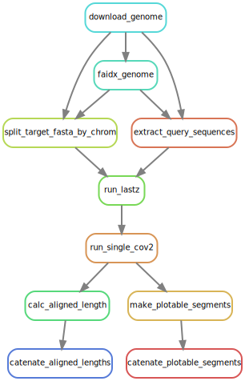
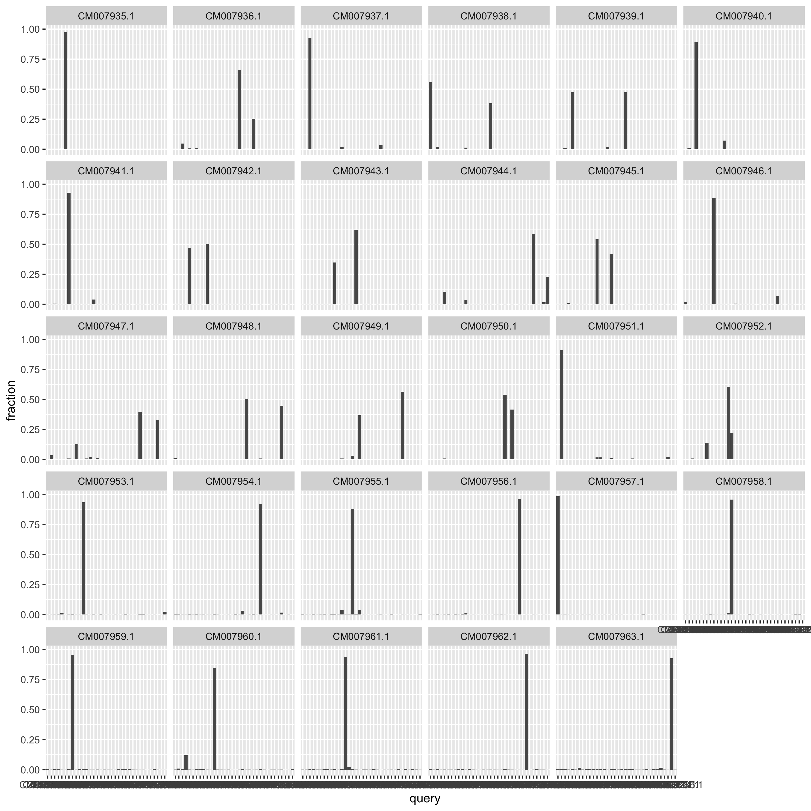
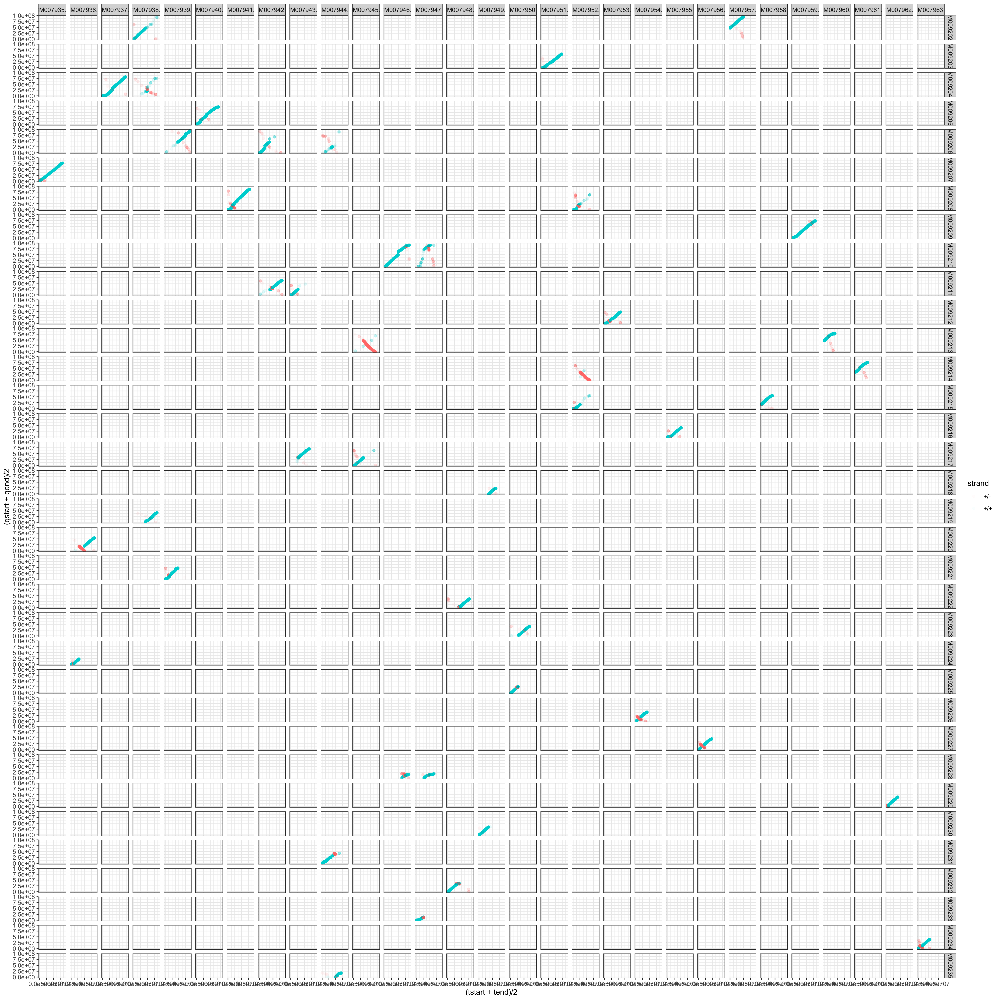

```{r setup, include=FALSE}
knitr::opts_chunk$set(echo = TRUE)
```

## Introduction

For a lot of interesting population genomics work today, it is necessary or useful to know
which allele at a SNP is derived, and which is ancestral in the species under study.
For many cases, that information can be obtained (or at least approximated) by finding the
base carried at each such site in a closely related species.  An argument could be made for
getting as many closely related species as possible, putting
them all on a phylogenetic tree, along with the focal species, and then doing a gigantic,
genome-wide multiple alignment and inferring the ancestral states at each position
from all that information.  That sounds like a lot of work when you are
trying to get a whole genome's worth of ancestral states, and in many cases you might not
have a whole lot of genomes to work with, anyway.  So, here, I will take a cue from
an ANGSD website example [here](http://www.popgen.dk/angsd/index.php/Thetas,Tajima,Neutrality_tests)
where they use chimpanzee to designate ancestral states so as to polarize the site frequency
spectrum.

For both the program [ANGSD](http://www.popgen.dk/angsd/index.php/ANGSD) and the more recently
developed software [RELATE](https://myersgroup.github.io/relate/) this information about
ancestral alleles/bases can be input to the programs as a fasta file of the same length as the
focal species fasta file, but just including the sequence of the closely related species.  

It seems to me that there are not a lot of really great workflows for creating such fasta
files.  That is what I am trying to provide here.  My main goal for it is aligning large chunks
of genomes between closely related salmonid species, and then creating fasta files giving the
ancestral alleles.

For example, if I have a lot of high-quality, whole-genome sequencing from _O. mykiss_ that I
want to phase and throw into RELATE, I can align the Chinook salmon genome to the _O. mykiss_
genome and use that to make the ancestral fasta.  In this case, we say that the _O. mykiss_
genome is our _target_ genome, and Chinook salmon is our _query_ genome.  For the most part,
I am most interested in segments that have been assembled into chromosomes in both species.

Especially because of the duplicated genome history of salmonids, it is worth taking
a look at the results of an original round of alignment in order to carefully select
which chromosomes appear to be homologous.  Therefore, this workflow must be down in
two steps:

I. Do an initial round of alignment and plot some results from that.
From these results, create a CSV file like that found in `config/homolog_sets.csv`,
which tells us which query-species chromosomes appear to be homologous to
each target-species chromosome. The first 10 lines of that file appear here.
```csv
`r paste(readLines("config/homolog_sets.csv"), collapse = "\n")[1:10]`
```
Note that if multiple query chromosomes align to a target chromsome, they are separated
by spaces.

II. Using the file `config/homolog_sets.csv`, map only the appropriate homologs to
each target chromosome, and then turn the result into the ancestral fasta file.

Because there are two distinct steps to this workflow, and there has to be some
user interaction, there is not a simple `all` rule that runs everything.  Rather,
explicit output files must requested from snakemake on the command line, as described
in the sections of the overview below.

## Overview of the two parts of the workflow

### Finding query chromosomes homologous to each target chromosome

In brief, this part of the snakemake workflow does this:

1. Choose the target genome and declare which sequences in that you want to align things
to. For my purposes this is typically the assembled chromosomes.
2. Choose the query genome and declare which sequences from the query you wish to map to the
target.  Once again, this is typically the assembled chromosomes, though one might wish to
use all the sequences, even those that are not fully assembled into chromosomes.
3. Break the target genome into a bunch of smaller fastas, each containing exactly one of the
sequences/chromosomes. We will call these "single-chromosome fastas."
4. Map all the query sequences against each of the single-chromosome fastas.
5. Run single_cov2 on each of resulting MAFs, so that we retain only the very best alignment of
any overlapping alignments.
6. Summarize how many base pairs are aligned onto each single-chromosome fasta from each of the
different target query sequences (i.e. chromosomes). And also prepare a file of alignments
that is suitable for plotting with ggplot. 

These steps are all accomplished by running the
workflow to this point with a command like:
```bash
snakemake --cores 20   --use-conda  \
   results/report/step20_notransition_inner1000_ident92/aligned_lengths.tsv \
   results/report/step20_notransition_inner1000_ident92/plotable_segments.tsv
```
**BigNote:** The above command requests _by way of the directory name used_ (i.e.,
`step20_notransition_inner1000_ident92`), that the following
options be passed to `lastz`: `--steps=20 --notransition --inner=1000 --identity=92.`
Users wanting different values of those parameters can simply request the output
file in a different directory, like `step15_notransition_inner950_ident97`, and
snakemake will take care of it.  This way, it makes it pretty easy to do multiple
runs at different parameter options and collect all the results.

We can make a rulegraph for those outputs like this:
```sh
snakemake --rulegraph    results/report/step20_notransition_inner1000_ident92/aligned_lengths.tsv   results/report/step20_notransition_inner1000_ident92/plotable_segments.tsv | dot -Tsvg > figs/rulegraph1.svg
```
It looks like this:

```{r, echo=FALSE, out.width='42%', fig.align='center'}

```


Once those two output files are available, they can be used to create some plots using the
not-so-well-documented code in directory `misc` like this:
```{r, echo=FALSE, out.width='100%'}

```

The plot above (made in `misc/plot-aligned-length.R) shows that of the
material that aligns to each chromosome, most of it comes
from one, two, or three different query chromosomes.

When you go assigning homologs to chromosomes, however, it is also important
to see if a section of a query chromosome appears to align to two places (which should
not happen, usually), or if there are paralogous segments that are mapping anywhere.
To answer those questions, it is helpful to make a huge cross-alignment facet grid like the
one made by the script `misc/homology-grid.R`:
```{r, echo=FALSE, out.width='100%'}

```

It is pretty easy to go through this by eyeball and choose the query chromosomes
that belong in each row of the `config/homolog_sets.csv` files.  Basically, dark
lines in the columns represent parts of different query chromosomes that map to the same
target chromosome. Dark lines in the rows represent parts of a single query chromosome
that align to different target chromsomes. You want to choose things so that no part of a query chromosome
is going to get re-used.  This means that the same part of the query chromosome
should not appear in multiple columns.  Also, mapping of paralogs is somewhat evident here
by the (somewhat lighter) lines.  These should not be paired with the target chromosomes.

Once the file `config/homolog_sets.csv` is made, you can proceed to the next section.


### Mapping homologous chromosomes and creating a fasta

The contents of `config/homolog_sets.csv` are used to guide the mapping in the
second half of the workflow.  In brief, the steps in this part of the snakemake
workflow are as follows:

1. Create a query fasta file for each target chromosome that contains the query chromosomes
that have some homologous material to the target. 
2. Run `lastz` to map each query fasta against each target fasta.  (You might want to use
more stringent alignment criteria for this.)
3. Run `single_cov2` on each of the outputs. 
4. Run `maf2fasta` (from the multiz package) on each the resulting single_cov2 outputs.
5. Use an R-script to condense the resulting fastas into a fasta that is congruent with
the target genome.  And at the same time, prepare a summary of the number of bases
in the alignment for that chromosome that are of different types (e.g. target has a `C` and
query has an `A`, etc.).
6. Catenate all the those condensed fastas into a file with a path like:
```
results/catenated_anc_fasta/step20_notransition_inner1000_ident95/ancestral.fna
```
and catenate all the summaries into a file with a path like this:
```
results/report/step20_notransition_inner1000_ident95/pairwise_aligned_base_summary.csv
```


## Configuration

All the configuration can be done by modifying the contents of the `config` directory. 

This workflow is set up showing the default values used for mapping the Chinook genome (the
query) to the _O. mykiss_ genome (our target).  You can change values in the
`config/config.yaml` file to work for your own pair of closely related species.  
